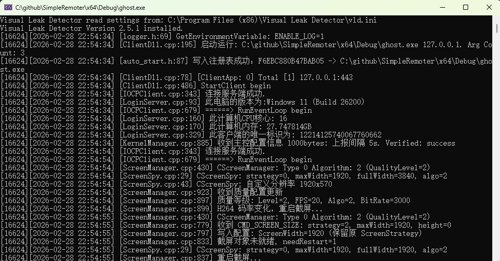

# SimpleRemoter

**[简体中文](./ReadMe.md) | [繁體中文](./ReadMe_TW.md) | [English](./ReadMe_EN.md)**

<p align="center">
  <a href="https://github.com/yuanyuanxiang/SimpleRemoter/stargazers">
    
  </a>
  <a href="https://github.com/yuanyuanxiang/SimpleRemoter/network/members">
    
  </a>
  <a href="https://github.com/yuanyuanxiang/SimpleRemoter/releases">
    
  </a>
  
  
  
  
</p>

<p align="center">
  <a href="https://github.com/yuanyuanxiang/SimpleRemoter/releases/latest">
    
  </a>
</p>

---

> [!WARNING]
> **Important Legal Notice**
>
> This software is intended **solely for educational purposes and authorized use cases** such as:
> - Remote IT administration within your own organization
> - Authorized penetration testing and security research
> - Personal device management and technical learning
>
> **Unauthorized access to computer systems is illegal.** Users are fully responsible for compliance with all applicable laws. The developers assume no liability for misuse.

---

## Table of Contents

- [Overview](#overview)
- [Disclaimer](#disclaimer)
- [Features](#features)
- [Technical Highlights](#technical-highlights)
- [Architecture](#architecture)
- [Getting Started](#getting-started)
- [Client Support](#client-support)
- [Changelog](#changelog)
- [Related Projects](#related-projects)
- [Contact](#contact)

---

## Overview

**SimpleRemoter** is a full-featured remote control solution, rebuilt from the classic Gh0st framework using modern C++17. Started in 2019, it has evolved into an enterprise-grade remote management tool supporting both **Windows and Linux** platforms.

### Core Capabilities

| Category | Features |
|----------|----------|
| **Remote Desktop** | Real-time screen control, multi-monitor support, H.264 encoding, adaptive quality |
| **File Management** | Bi-directional transfer, resumable uploads, C2C transfer, SHA-256 verification |
| **Terminal** | Interactive shell, ConPTY/PTY support, modern web terminal |
| **System Management** | Process/service/window management, registry browsing, session control |
| **Media Capture** | Webcam monitoring, audio listening, keylogging |
| **Networking** | SOCKS proxy, FRP tunneling, port forwarding |

### Use Cases

- **Enterprise IT Operations**: Batch management of intranet devices, remote troubleshooting
- **Remote Work**: Secure access to office computers, file synchronization
- **Security Research**: Penetration testing, red team exercises, security audits
- **Technical Learning**: Network programming, IOCP model, encrypted transmission practice

**Original Source:** [zibility/Remote](https://github.com/zibility/Remote) | **Started:** 2019.1.1

[](https://star-history.com/#yuanyuanxiang/SimpleRemoter&Date)

---

## Disclaimer

**Please read the following statement carefully before using this software:**

1. **Lawful Use**: This project is intended solely for legitimate technical research, educational exchange, and authorized remote management. It is strictly prohibited to use this software for unauthorized access to others' computer systems, data theft, privacy surveillance, or any other illegal activities.

2. **User Responsibility**: Users must comply with the laws and regulations of their country/region. Any legal liability arising from the use of this software shall be borne by the user.

3. **No Warranty**: This software is provided "as is" without any express or implied warranties, including but not limited to warranties of merchantability or fitness for a particular purpose.

4. **Limitation of Liability**: The developers shall not be liable for any direct, indirect, incidental, special, or consequential damages arising from the use, misuse, or inability to use this software.

5. **Copyright Notice**: This project is open-sourced under the MIT License, allowing free use, modification, and distribution, provided that the original copyright notice is retained.

**By continuing to use this software, you acknowledge that you have read, understood, and agreed to all the above terms.**

---

## Features

### Remote Desktop


- **Multiple Capture Methods**: GDI (high compatibility), DXGI (high performance), Virtual Desktop (background operation)
- **Smart Compression Algorithms**:
  - DIFF algorithm - SSE2 optimized, transmits only changed regions
  - RGB565 algorithm - 50% bandwidth savings
  - H.264 encoding - Video-level compression for high frame rate scenarios
  - Grayscale mode - Minimal bandwidth consumption
- **Adaptive Quality**: Automatically adjusts frame rate (5-30 FPS), resolution, and compression based on network RTT
- **Multi-Monitor**: Support for screen switching and multi-screen wall display
- **Privacy Screen**: Hide controlled screen, supports control during lock screen
- **File Drag & Drop**: Ctrl+C/V cross-device copy and paste files

### File Management


- **V2 Transfer Protocol**: Newly designed, supports large files (>4GB)
- **Resumable Transfer**: Automatic recovery after network interruption, persistent state
- **C2C Transfer**: Direct transfer between clients without going through master
- **Integrity Verification**: SHA-256 hash verification ensures file integrity
- **Batch Operations**: Supports file search, compression, batch transfer

### Terminal Management


- **Interactive Shell**: Full command line experience with Tab completion
- **ConPTY Technology**: Native pseudo-terminal support for Windows 10+
- **Modern Web Terminal**: Based on WebView2 + xterm.js (v1.2.7+)
- **Terminal Resizing**: Adaptive window size

### Process & Window Management

| Process Management | Window Management |
|-------------------|-------------------|
|  |  |

- **Process Management**: View process list, CPU/memory usage, start/terminate processes
- **Code Injection**: Inject DLL into target process (requires admin privileges)
- **Window Control**: Maximize/minimize/hide/close windows

### Media Features

| Video Management | Audio Management |
|-----------------|------------------|
|  |  |

- **Webcam Monitoring**: Real-time video stream, adjustable resolution
- **Audio Listening**: Remote sound capture, bi-directional voice support
- **Keylogging**: Online/offline recording modes

### Other Features

- **Service Management**: View and control Windows services
- **Registry Browsing**: Read-only browsing of registry contents
- **Session Control**: Remote logout/shutdown/restart
- **SOCKS Proxy**: Establish proxy tunnel through client
- **FRP Tunneling**: Built-in FRP support for easy intranet penetration
- **Code Execution**: Remote DLL execution with hot update support

---

## Technical Highlights

### High-Performance Network Architecture

```
┌─────────────────────────────────────────────────────────┐
│                    IOCP Communication Model              │
├─────────────────────────────────────────────────────────┤
│  • I/O Completion Ports: Most efficient async I/O on    │
│    Windows                                               │
│  • Single master supports 10,000+ concurrent connections │
│  • Supports TCP / UDP / KCP transport protocols          │
│  • Auto-chunking for large packets (max 128KB send buf)  │
└─────────────────────────────────────────────────────────┘
```

### Adaptive Quality Control

Intelligent quality adjustment system based on RTT (Round-Trip Time):

| RTT Latency | Quality Level | FPS | Resolution | Compression | Use Case |
|-------------|---------------|-----|------------|-------------|----------|
| < 30ms | Ultra | 25 FPS | Original | DIFF | LAN office |
| 30-80ms | High | 20 FPS | Original | RGB565 | General office |
| 80-150ms | Good | 20 FPS | ≤1080p | H.264 | Cross-network/Video |
| 150-250ms | Medium | 15 FPS | ≤900p | H.264 | Cross-network office |
| 250-400ms | Low | 12 FPS | ≤720p | H.264 | Poor network |
| > 400ms | Minimal | 8 FPS | ≤540p | H.264 | Very poor network |

- **Zero Overhead**: Reuses heartbeat packets to calculate RTT
- **Fast Downgrade**: Triggers after 2 detections, responds to network fluctuations
- **Cautious Upgrade**: Quality improves only after 5 stable readings
- **Cooldown Mechanism**: Prevents frequent switching

### V2 File Transfer Protocol

```cpp
// 77-byte protocol header + filename + data payload
struct FileChunkPacketV2 {
    uint8_t   cmd;            // COMMAND_SEND_FILE_V2 = 85
    uint64_t  transferID;     // Transfer session ID
    uint64_t  srcClientID;    // Source client ID (0=master)
    uint64_t  dstClientID;    // Destination client ID (0=master, C2C)
    uint32_t  fileIndex;      // File index (0-based)
    uint32_t  totalFiles;     // Total file count
    uint64_t  fileSize;       // File size (supports >4GB)
    uint64_t  offset;         // Current chunk offset
    uint64_t  dataLength;     // Current chunk data length
    uint64_t  nameLength;     // Filename length
    uint16_t  flags;          // Flags (FFV2_LAST_CHUNK, etc.)
    uint16_t  checksum;       // CRC16 checksum (optional)
    uint8_t   reserved[8];    // Reserved for extension
    // char filename[nameLength];  // UTF-8 relative path
    // uint8_t data[dataLength];   // File data
};
```

**Features**:
- Large file support (uint64_t breaks 4GB limit)
- Resumable transfer (state persisted to `%TEMP%\FileTransfer\`)
- SHA-256 integrity verification
- C2C direct transfer (client to client)
- V1/V2 protocol compatibility

### Screen Transmission Optimization

- **SSE2 Instructions**: Hardware-accelerated pixel difference calculation
- **Multi-threaded Parallel**: Thread pool for chunked screen data processing
- **Scroll Detection**: Identifies scrolling scenarios, reduces bandwidth by 50-80%
- **H.264 Encoding**: Based on x264, GOP control, video-level compression

### Security Mechanisms

| Layer | Measures |
|-------|----------|
| **Transport Encryption** | AES-256 data encryption with configurable IV |
| **Authentication** | Signature verification + HMAC authentication |
| **Authorization Control** | Serial number binding (IP/domain), multi-level authorization |
| **File Verification** | SHA-256 integrity verification |
| **Session Isolation** | Session 0 independent handling |

### Dependencies

| Library | Version | Purpose |
|---------|---------|---------|
| zlib | 1.3.1 | General compression |
| zstd | 1.5.7 | High-speed compression |
| x264 | 0.164 | H.264 encoding |
| libyuv | 190 | YUV conversion |
| HPSocket | 6.0.3 | Network I/O |
| jsoncpp | 1.9.6 | JSON parsing |

---

## Architecture


### Two-Layer Control Architecture (v1.1.1+)

```
Super User
    │
    ├── Master 1 ──> Client Group A (up to 10,000+)
    ├── Master 2 ──> Client Group B
    └── Master 3 ──> Client Group C
```

**Design Advantages**:
- **Hierarchical Control**: Super user can manage any master program
- **Isolation**: Clients managed by different masters are isolated from each other
- **Horizontal Scaling**: 10 Masters × 10,000 clients = 100,000 devices

### Master Program (Server)

The master program **YAMA.exe** provides a graphical management interface:


- High-performance server based on IOCP
- Client group management
- Real-time status monitoring (RTT, geolocation, active window)
- One-click client generation

### Controlled Program (Client)



**Runtime Forms**:

| Type | Description |
|------|-------------|
| `ghost.exe` | Standalone executable, no external dependencies |
| `TestRun.exe` + `ServerDll.dll` | Separate loading, supports in-memory DLL loading |
| Windows Service | Background operation, supports lock screen control |
| Linux Client | Cross-platform support (v1.2.5+) |

---

## Getting Started

### 5-Minute Quick Start

No compilation required, download and run:

1. **Download Release** - Get the latest version from [Releases](https://github.com/yuanyuanxiang/SimpleRemoter/releases/latest)
2. **Launch Master** - Run `YAMA.exe` and enter the license info (see trial license below)
3. **Generate Client** - Click the "Generate" button in the toolbar, configure server IP and port
4. **Deploy Client** - Copy the generated client to the target machine and run it
5. **Start Control** - Once the client comes online, double-click to open remote desktop

> [!TIP]
> For initial testing, run both master and client on the same machine using `127.0.0.1` as the server address.

### Build Requirements

- **Operating System**: Windows 10/11 or Windows Server 2016+
- **Development Environment**: Visual Studio 2019 / 2022 / 2026
- **SDK**: Windows 10 SDK (10.0.19041.0+)

### Build Steps

```bash
# 1. Clone the repository (must use git clone, do not download as zip)
git clone https://github.com/yuanyuanxiang/SimpleRemoter.git

# 2. Open the solution
#    Open SimpleRemoter.sln with VS2019+

# 3. Select configuration
#    Release | x86 or Release | x64

# 4. Build
#    Build -> Build Solution
```

**Common Issues**:
- Dependency library conflicts: [#269](https://github.com/yuanyuanxiang/SimpleRemoter/issues/269)
- Non-Chinese system garbled text: [#157](https://github.com/yuanyuanxiang/SimpleRemoter/issues/157)
- Compiler compatibility: [#171](https://github.com/yuanyuanxiang/SimpleRemoter/issues/171)

### Deployment Methods

#### Intranet Deployment

Master and clients are on the same LAN, clients connect directly to master IP:Port.

#### Internet Deployment (FRP Tunneling)

```
Client ──> VPS (FRP Server) ──> Local Master (FRP Client)
```

For detailed configuration, please refer to: [Reverse Proxy Deployment Guide](./反向代理.md)

### Authorization

Starting from v1.2.4, a trial password is provided (2-year validity, 20 concurrent connections, intranet only):

```
Authorization: Bound by computer IP
Master IP: 127.0.0.1
Serial: 12ca-17b4-9af2-2894
Password: 20260201-20280201-0020-be94-120d-20f9-919a
Verification: 6015188620429852704
Valid: 2026-02-01 to 2028-02-01
```

---

## Client Support

### Windows Client

**System Requirements**: Windows 7 SP1 and above

**Feature Completeness**: ✅ All features supported

### Linux Client (v1.2.5+)

**System Requirements**:
- Display Server: X11/Xorg (Wayland not yet supported)
- Required: libX11
- Recommended: libXtst (XTest extension), libXss (idle detection)

**Feature Support**:

| Feature | Status | Implementation |
|---------|--------|----------------|
| Remote Desktop | ✅ | X11 screen capture, mouse/keyboard control |
| Remote Terminal | ✅ | PTY interactive shell |
| File Management | ✅ | Bi-directional transfer, large file support |
| Process Management | ✅ | Process list, terminate processes |
| Heartbeat/RTT | ✅ | RFC 6298 RTT estimation |
| Daemon Process | ✅ | Double fork daemonization |
| Clipboard | ⏳ | In development |
| Session Management | ⏳ | In development |

**Build Instructions**:

```bash
cd linux
cmake .
make
```

---

## Changelog

### v1.2.7 (2026.2.28)

**V2 File Transfer Protocol**

- Support C2C (client-to-client) direct transfer
- Resumable transfer and large file support (>4GB)
- SHA-256 file integrity verification
- WebView2 + xterm.js modern terminal
- Linux file management support
- Host list batch update optimization, reduced UI flickering

### v1.2.6 (2026.2.16)

**Remote Desktop Toolbar Rewrite**

- Status window showing RTT, FPS, resolution
- Fullscreen toolbar supports 4 positions and multi-monitor
- H.264 bandwidth optimization
- License management UI improvements

### v1.2.5 (2026.2.11)

**Adaptive Quality Control & Linux Client**

- RTT-based intelligent quality adjustment
- RGB565 algorithm (50% bandwidth savings)
- Scroll detection optimization (50-80% bandwidth savings)
- Linux client initial release

For complete update history, see: [history.md](./history.md)

---

## Related Projects

- [HoldingHands](https://github.com/yuanyuanxiang/HoldingHands) - Full English interface remote control
- [BGW RAT](https://github.com/yuanyuanxiang/BGW_RAT) - Big Grey Wolf 9.5
- [Gh0st](https://github.com/yuanyuanxiang/Gh0st) - Classic Gh0st implementation

---

## Contact

| Channel | Link |
|---------|------|
| **QQ** | 962914132 |
| **Telegram** | [@doge_grandfather](https://t.me/doge_grandfather) |
| **Email** | [yuanyuanxiang163@gmail.com](mailto:yuanyuanxiang163@gmail.com) |
| **LinkedIn** | [wishyuanqi](https://www.linkedin.com/in/wishyuanqi) |
| **Issues** | [Report Issues](https://github.com/yuanyuanxiang/SimpleRemoter/issues) |
| **PR** | [Contribute](https://github.com/yuanyuanxiang/SimpleRemoter/pulls) |

### Sponsorship

This project originated from technical learning and personal interest. The author will update irregularly based on spare time. If this project has been helpful to you, please consider sponsoring:

[](https://github.com/yuanyuanxiang/yuanyuanxiang/blob/main/images/QR_Codes.jpg)

---

<p align="center">
  <sub>If you like this project, please give it a ⭐ Star!</sub>
</p>
